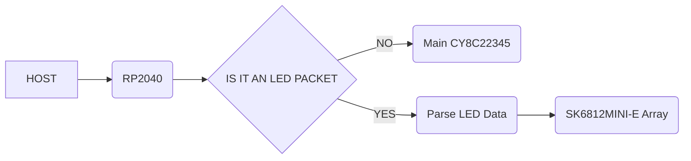
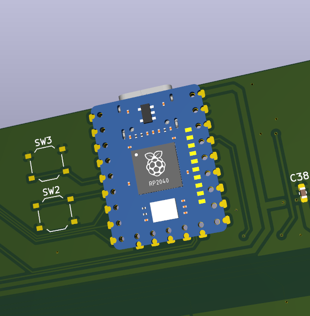
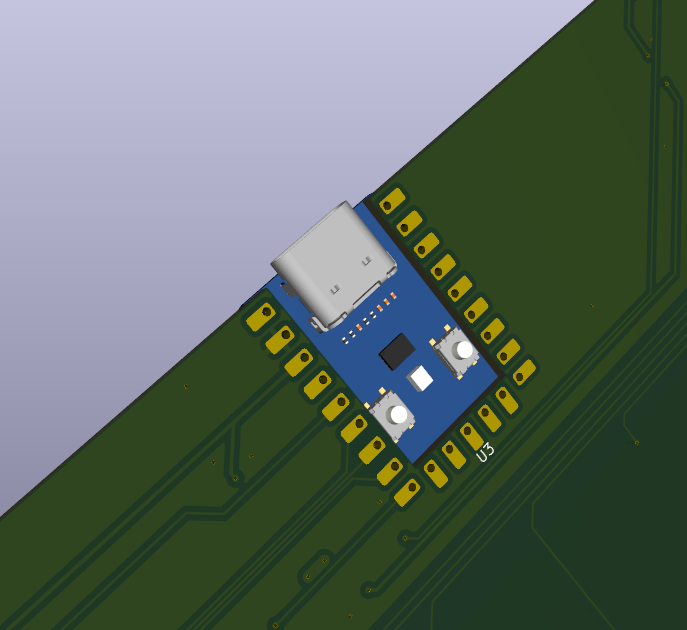

# slidrr-PSoC
An attempt at a recreation of the official CHUNITHM Ground Slider for home use.

This project aims to use the same hardware* and firmware of the real ground slider for a more accurate and _faithful_ recreation of CHUNITHM's ground slider input.

<sub>*Same PSoCs. LED driver, power management and other things are ignored.</sub>

**Why?**
---
It all started because I couldn't get a _thick_ (3mm) acrylic overlay working on my original [simpl-slidrr](https://github.com/infecta/simpl-slidrr) project simply due to the fact that the MPR121s perform badly on any overlay above 2mm in thickness.

With this project, since we are using the same PSoCs as the official ground slider it gives us the following benefits:

- As close as possible touch polling/scanning to match arcade
- Thick overlays work reliably (Tested with loose/unscrewed 3mm and 6mm briefly)
- No guesswork needed for psoc firmware

**What this project includes**
---
- KiCad Source Files for the PCB
- CAD Files for the case including the Fusion360 project
- Firmware for the RP2040 Zero

> [!WARNING]
>
> **Agentic AI usage disclosure**
>
> A huge chunk of the code was provided by an AI agent. This only applies to the firmware for the RP2040 Zero.
>
> You may experience weird issues, whacky edge cases that might happen.

**Hardware Architecture**
---
The main CY8C22345 communicates to the RP2040 through UART. The firmware will pass those commands transparently unless it's an LED packet in which case, will be parsed by the RP2040 itself to drive the LEDs   

To put it in simple terms, the main job of the RP2040 is a Serial to USB adapter*

<sub>_*If we just gloss over the fact it also does air tower and IO4 emulation_</sub>


<sup>_Very simplified flowchart of what it does._</sup>

## Parts Needed (PCB)
<sub>All SMD components are 0603 unless stated otherwise</sub>
| Item | Quantity | Notes |
|-|-|-|
| CY8C22345 | 2 | [Link(Taobao)](https://item.taobao.com/item.htm?app=firefox&bxsign=scd9rOtEH5153mIeRH7GMPgw3-ES263TqwWZAUW9XdXCYrmNxd8LlLLmxuiTGIFg5Yr0s1BOR5-z54nxIae25Bysl0wQ_QsDgy9YGaOTnT1PLHMj1ds6YtYJkS3Nt2SaPQEnqRAZ1HRSVvh9NfvvPF8rQ&cpp=1&id=972956170652&price=5.8). Same chips used as the official ground slider. Depending on where you are, these may be easier or harder to source. Must be an SSOP-28 package to fit on the PCB. If you found a different package you'll have modify the PCB. Get extras just in case things go wrong (bad chip, broken pins etc.)
| Arduino Pro Micro | 1 | A cheap (and slightly difficult) way to flash the PSoC with the ground slider firmware using [arduino_hssp](https://github.com/miracoli/arduino_hssp). **Make sure it's the 5V model**. **NOTE: You will need linux to use this with [psocdude](https://github.com/miracoli/psocdude)**. If you have another way of programming the PSoC like a MiniProg then go that route.
| WaveShare RP2040 Zero | 1 | Main brains (UART Passthrough, IO4, LED driver)
| [This](./guide-media/button.png) SMD tactile switch | 2 | I'm not sure what these are formally called. but I used these for the footprint on the PCB.
| SN74LV1T34DBVR Logic Level Shifter | 1 | This is for the SK6812MINI-E LED data pins (Needs 5V logic rather than 3.3V logic). You can substitute this with any other level shifter provided it's pin compatible or modify the PCB if you want to use a different one.
| SK6812MINI-E LEDs | 31 | LEDs.
| 4x DIP switch | 1 | Temporary but needed during flashing & troubleshooting. Mainly to connect both PSoC I<sup>2</sup>C lines and connect to the I<sup>2</sup>C pull-up resistors.
| JST XH5 Connectors | 2 | Optional. But nice to have to reliably flash PSoCs
| JST XH6 Connectors | 2 | For connecting air towers
| 100nf/0.1uF X5R Capacitors | 32 | Decoupling caps for level shifter and LEDs 
| 4.7uF X5R Capacitors | 4 | Decoupling caps for PSoCs
| 4.7nF X7R Capacitors | 2 | CapSense<sup>TM</sup> Modulator cap
| 560R/560ohm Resistors | 32 | Placed before the touch electrodes. Values are just an estimate and typical range I have tested.
| 1K Resistor | 1 | Part of a voltage divider to shift down the 5V UART signal to 3.3V going into the RP2040 Zero
| 2K Resistor | 1 | Part of a voltage divider to shift down the 5V UART signal to 3.3V going into the RP2040 Zero
| 3K - 4.7K Resistor | 2 | I<sup>2</sup>C pull-up resistors. Within this range should be fine.
| 330R/330ohm Resistor | 1 | Needed for the logic level shifter. Followed datasheet. If changing level shifter check datasheet for info.
| [whowechina chu_pico IR airs](https://github.com/whowechina/chu_pico) | 1 pair | IR tower code based around this design. Check chu_pico repo for more info. **IMPORTANT:** CURRENT LIMITING RESISTORS NEED TO BE CHANGED TO A HIGHER VALUE. CHECK BELOW.

## Notes

The chu_pico airs draw around ~878mA per emitter with 0.75ohm resistor (If we were to follow whowe's guide for the airs). Either due to the WaveShare RP2040 zero's 3v3 regulator or general power budget **it is too high** and UART will fail as there is not enough power to go around for the PSoCs and possibly the LEDs.

> [!WARNING]
>
> Using the airs as-is with the 0.75ohm resistors **may** burn out the 3v3 regulator as it can get **very** hot.
> 

I suggest using a 50ohm or 100ohm resistor instead. This drops the emitter amperage draw to about ~40mA and ~21mA respectively.
Peak for a single IR phase (2 IR Emitters) would be ~80mA and ~42mA respectively too, which is well within the budget

## Build _*"guide"*_

This doc fully assumes you are comfortable with soldering SMD components.

_Protip: Use the Interactive Html Bom plugin on KiCAD to easily figure out where all the components go._

### Ordering the PCB
---
We're using [JLCPCB](https://jlcpcb.com) for this guide.

You can leave everything on default but I recommend a black solder mask so that the lights look better

### Notes for the RP2040-Zero
---
I won't lie, I forgot why I even placed the footprint they way I did.
But the RP2040 chip is facing **upwards** so please keep that in mind.




### Flashing the firmware
---
**This section will assume you are doing the psocdude + arduino_hssp route.**

**This also assumes you have sourced your own dump of the offical 837-15330/Ground slider firmware**

**This section will not guide you on how to flash the arduino or compile psocdude. Use google or ask an LLM for guidance.**

Few things are needed to change in the `psocdude.conf` file in order to get it flashed.

Inside `psocdude.conf` find the `CY8C22345` line. It should look like this.
```bash
#------------------------------------------------------------
# CY8C22345
#------------------------------------------------------------

part
  id      = "CY8C22345";
  desc    = "CY8C22345";
  signature   = 0x00 0xD1;
  checksum_setup = CHECKSUM_SETUP_22_24_28_29_TST120_TMG120_TMA120;
  program_block = PROGRAM_BLOCK_21_22_23_24_28_29_TST_TMG_TMA;
  multi_bank = yes;
  memory "signature"
    size = 2;
  ;
;
```

Change it so it looks like this:
```bash
#------------------------------------------------------------
# CY8C22345
#------------------------------------------------------------

part
  id      = "CY8C22345";
  desc    = "CY8C22345";
  signature   = 0x00 0xD0;
  checksum_setup = CHECKSUM_SETUP_22_24_28_29_TST120_TMG120_TMA120;
  program_block = PROGRAM_BLOCK_21_22_23_24_28_29_TST_TMG_TMA;
  multi_bank = yes;
  memory "flash"
    paged     = yes;
    size      = 16384;
    page_size = 64;
    num_pages = 256;
    blocksize = 64;
    readsize  = 64;
  ;
  memory "signature"
    size = 2;
  ;
;
```

Flash the PSoC with:
```bash
psocdude -C psocdude.conf -p CY8C22345 -c arduino -P /dev/ttyACM0 -b 115200 -U flash:w:<DUMPED_FIRMWARE.bin/.hex>:r -F
```

#### Troubleshooting
---

**Scenario 1**

If your output looks like this:
```bash
Reading |                     | 0% 0.00spsocdude: ser_recv(): proggrammer is not responding
psocdude: error reading signature data for part "CY8C22345", rc=-1
psocdude: error reading signature data, rc=-1
```

It could be either one of 2 issues:

1. Unplug and replug your programmer, then try running the command again.

2. If that doesn't work check your solder connections.

**Scenario 2**

If your signature is 0xffff
1. Bad soldering.
2. Bad chip. (Unconfirmed)

I haven't figured out why this happens as of writing this. My only solution was switching out the chips with the extras I already had.

There might be more issues that I haven't experienced yet so I can't cover all bases.

### Case
---
TODO: CASE GUIDE HERE


## Credits

[whowechina](https://github.com/whowechina) - Air Code and PCB is heavily referenced and adapted for the firmware from the [chu_pico](https://github.com/whowechina/chu_pico) project.

[Cons&Stuff](https://consandstuff.github.io/) Discord Server - For guidance and troubleshooting of my project especially [somewhatlurker](https://github.com/somewhatlurker) for their insight of the slider protocol.
